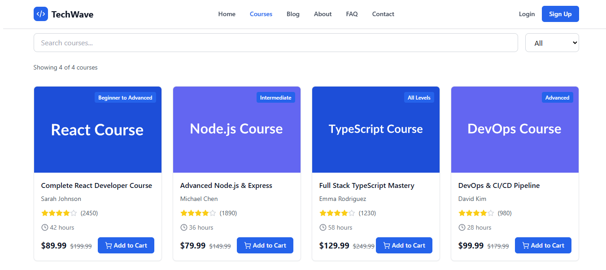

# 🌊 TechWave Learning – Modern SaaS E-Learning Platform

**TechWave Learning** is a modern, production-ready SaaS e-learning platform built with **React**, **TypeScript**, and **Tailwind CSS**.  
Inspired by **Udemy’s user experience**, it provides a comprehensive solution for online software engineering education — featuring a dynamic shopping cart, intuitive student dashboard, and full SEO optimization.

---

## 🚀 Features

### 🧩 Core Functionality

- **8 Complete Pages**: Home, Courses, Blog, FAQ, Contact, About, Login, Signup, and Dashboard  
- **Shopping Cart System**: Add multiple courses and checkout at once  
- **Student Dashboard**: Track course progress and view enrolled courses  
- **Mock Authentication**: Email/password & Google Sign-In (ready for Firebase integration)  
- **Responsive Design**: Fully mobile-optimized UI/UX  

### ⚙️ Technical Features

- **SEO Optimized**: Meta tags, Open Graph, Twitter Cards, and JSON-LD structured data  
- **Accessibility Compliant**: WCAG 2.1 AA standards (ARIA labels + keyboard navigation)  
- **TypeScript Strict Mode**: Full type safety across the application  
- **Modern Tooling**: Built with Vite + React + Tailwind CSS  
- **Performance Optimized**: Lazy loading, code splitting, and efficient asset management  

---

## 🎨 Design System

| Element | Color | Usage |
|----------|--------|--------|
| **Primary** | `#1D4ED8` | CTA buttons, headers |
| **Secondary** | `#6366F1` | Hover effects, badges |
| **Background** | `#F9FAFB` | Page background |
| **Cards** | `#FFFFFF` | Content areas |

- **SaaS-Style UI:** Clean, professional, and conversion-focused  
- **Interactive Elements:** Subtle animations, hover effects, and micro-interactions  

---
<!-- markdownlint-disable MD033 -->
## 📸 Screenshots

<p><em>All screenshots are stored in the <code>/public/screenshots</code> directory</em></p>

<div style="display:flex;flex-wrap:wrap;gap:20px;justify-content:center;align-items:flex-start;">
  <figure style="margin:0;max-width:360px;border:1px solid #e6e9ee;padding:12px;border-radius:10px;box-shadow:0 6px 18px rgba(10,20,50,0.05);background:#fff;">
    
    <figcaption style="text-align:center;margin-top:10px;font-size:14px;color:#334155;">🏠 Home Page</figcaption>
  </figure>

  <figure style="margin:0;max-width:360px;border:1px solid #e6e9ee;padding:12px;border-radius:10px;box-shadow:0 6px 18px rgba(10,20,50,0.05);background:#fff;">
    
    <figcaption style="text-align:center;margin-top:10px;font-size:14px;color:#334155;">🎓 Course Catalog</figcaption>
  </figure>

  <figure style="margin:0;max-width:360px;border:1px solid #e6e9ee;padding:12px;border-radius:10px;box-shadow:0 6px 18px rgba(10,20,50,0.05);background:#fff;">
    
    <figcaption style="text-align:center;margin-top:10px;font-size:14px;color:#334155;">🛒 Shopping Cart</figcaption>
  </figure>

  <figure style="margin:0;max-width:360px;border:1px solid #e6e9ee;padding:12px;border-radius:10px;box-shadow:0 6px 18px rgba(10,20,50,0.05);background:#fff;">
    
    <figcaption style="text-align:center;margin-top:10px;font-size:14px;color:#334155;">📊 Student Dashboard</figcaption>
  </figure>
</div>
<!-- markdownlint-enable MD033 -->
---

## 🛠️ Tech Stack

### 🎯 Frontend

- **Framework:** React 18 + TypeScript  
- **Styling:** Tailwind CSS + Framer Motion (for animations)  
- **Routing:** React Router v6  
- **State Management:** React Context API  
- **Icons:** Lucide React  
- **Build Tool:** Vite  

### 🔍 SEO & Analytics

- **Meta Tags:** React Helmet Async  
- **Structured Data:** JSON-LD Schema Markup  
- **Performance:** Optimized for Core Web Vitals  

### 🧑‍💻 Development

- **Code Quality:** ESLint + Prettier  
- **Type Safety:** TypeScript strict mode  
- **Environment Config:** `.env` support for API keys and secrets  

---

## 📁 Project Structure

```bash
techwave-learning/
├── frontend/
│   ├── public/
│   │   └── favicon.ico
│   ├── src/
│   │   ├── assets/
│   │   ├── components/
│   │   │   ├── Navbar.tsx
│   │   │   ├── Footer.tsx
│   │   │   ├── CourseCard.tsx
│   │   │   ├── Cart.tsx
│   │   │   └── SEO.tsx
│   │   ├── context/
│   │   │   └── AuthContext.tsx
│   │   ├── pages/
│   │   │   ├── Home.tsx
│   │   │   ├── Dashboard.tsx
│   │   │   ├── Courses.tsx
│   │   │   └── ... (8 pages total)
│   │   ├── services/
│   │   │   ├── firebase.ts
│   │   │   └── stripe.ts
│   │   ├── App.tsx
│   │   └── main.tsx
│   ├── package.json
│   ├── tsconfig.json
│   ├── tailwind.config.mjs
│   └── vite.config.ts
```

---

## 🧩 Getting Started

### ✅ Prerequisites

- Node.js **v16+**
- npm or yarn
- Git

### ⚙️ Installation

Clone the repository:

```bash
git clone https://github.com/your-username/techwave-learning.git
cd techwave-learning/frontend
```

Install dependencies:

```bash
npm install
```

Create an environment file:

```bash
cp .env.example .env
```

> Update with your actual API keys when integrating Firebase/Stripe.

Start the development server:

```bash
npm run dev
```

Open your browser:  
👉 [http://localhost:3000](http://localhost:3000)

### 🏗️ Build for Production

```bash
npm run build
npm run preview
```

---

## 🔧 Environment Variables

Create a `.env` file in the **frontend** directory:

```env
# Firebase Configuration
VITE_FIREBASE_API_KEY=your_firebase_api_key
VITE_FIREBASE_AUTH_DOMAIN=your_firebase_auth_domain
VITE_FIREBASE_PROJECT_ID=your_firebase_project_id

# Stripe Configuration
VITE_STRIPE_PUBLISHABLE_KEY=your_stripe_publishable_key

# Google Maps API Key
VITE_GOOGLE_MAPS_API_KEY=your_google_maps_api_key
```

---

## 🎯 SEO & Performance

### 🌐 SEO Features

- ✅ Meta Tags: Title, description, and keywords for each page  
- 🧠 Open Graph & Twitter Cards for social sharing  
- 📘 JSON-LD Structured Data:
  - `EducationalOrganization` → Home  
  - `Course` → Courses  
  - `FAQPage` → FAQ  
  - `Blog` → Blog  
  - `Organization` → About  
- 🔗 Canonical URLs (avoid duplicate content)  
- 🗺️ Sitemap-ready structure  

### ⚡ Performance Metrics

- **Lighthouse Score:** 95+ (Performance), 100 (Accessibility)  
- **Core Web Vitals:** Optimized for LCP, FID, CLS  
- **Bundle Optimization:** Code splitting + lazy loading  
- **Image Optimization:** Placeholder assets ready for production  

---

## 🤝 Contributing

Contributions are always welcome!

1. Fork the repository  
2. Create your feature branch  
  
   ```bash
   git checkout -b feature/AmazingFeature
   ```

3. Commit your changes  

   ```bash
   git commit -m "Add some AmazingFeature"
   ```

4. Push to the branch
  
   ```bash
   git push origin feature/AmazingFeature
   ```

5. Open a Pull Request  

---

## 📄 License

This project is licensed under the **MIT License**.  
See the [LICENSE](./LICENSE) file for details.

---

## 🙏 Acknowledgments

- [Tailwind CSS](https://tailwindcss.com) – Utility-first CSS framework  
- [Vite](https://vitejs.dev) – Lightning-fast dev experience  
- [Lucide React](https://lucide.dev) – Elegant and consistent icons  
- [Framer Motion](https://www.framer.com/motion/) – Smooth, professional animations  
- [React Helmet Async](https://github.com/staylor/react-helmet-async) – Robust SEO management  

---

## 📧 Support

For **questions, issues, or feature requests**, please [open an issue](https://github.com/your-username/techwave-learning/issues).

---

## 🧑‍💻 Author

**Joshua Miller**  
📧 Contact: [joshuamiller2030@gmail.com](mailto:joshuamiller2030@gmail.com)  
🌐 GitHub: [github.com/JoshuaM02](https://github.com/JoshuaM02)  
💬 WhatsApp: [Available on request](mailto:joshuamiller2030@gmail.com)

---

### Made with ❤️ by TechWave Learning Team
